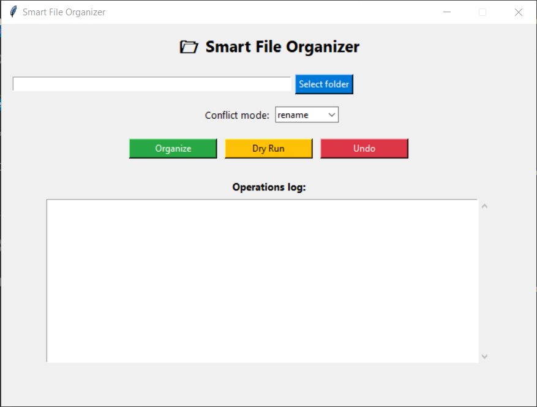
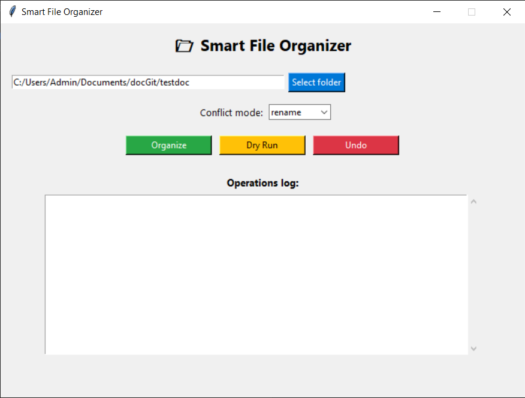
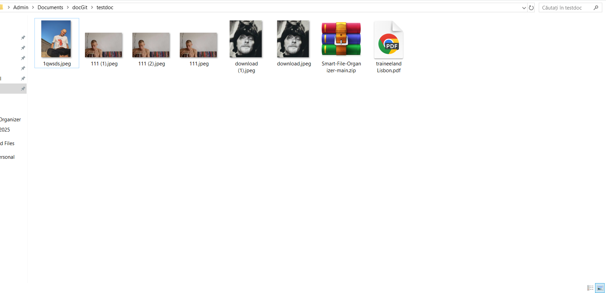
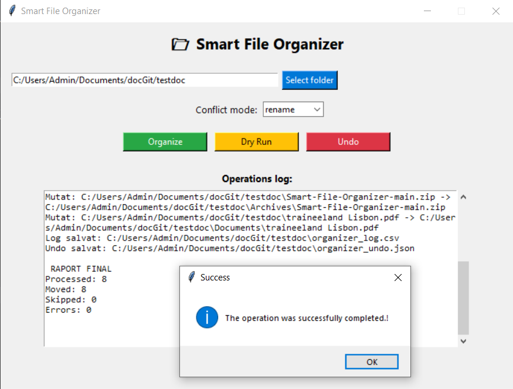
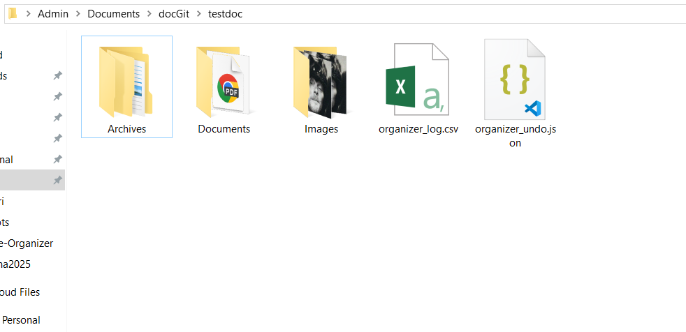

<pre>
Smart File Organizer

Made a Python tool that automatically organizes your files into folders like Images, Documents, Archives, etc.
Basically, you run one command (or use a simple GUI) and your files are sorted.

What it does:
Sorts files by extension (automatically detects the type)
Dry Run — see what would happen without actually changing anything
Undo — revert the last organization if you messed up
Configurable conflict handling (rename or skip)
GUI with Tkinter — if you don't wanna deal with terminal stuff
Logs everything to .csv and .json — so you know exactly what got moved

Installation:
Clone the repo:
clone https://github.com/Kurai-bit/Smart-File-Organizer.git
cd Smart-File-Organizer

Usage (Command Line):
-Organize a folder:
python organizer.py <path_to_folder>
-Preview changes (Dry Run):
python organizer.py <path_to_folder> --dry-run
-Undo last operation:
python organizer.py <path_to_folder> --undo

Handle conflicts:
python organizer.py <path_to_folder> --conflict-mode skip
python organizer.py <path_to_folder> --conflict-mode rename

GUI Mode:
Run the graphical interface:
python gui.py

The GUI allows you to select a folder, choose operation mode (Normal / Dry Run / Undo), run organization visually and view logs in real time.

Log Files:
organizer_log.csv — records timestamp, source, and destination for each move
organizer_undo.json — stores data needed to revert the last operation

Configuration:
You can edit config.json to customize which file extensions belong to each category.
Example:
{
  "Images": [".jpg", ".jpeg", ".png"],
  "Documents": [".pdf", ".docx", ".txt"],
  "Archives": [".zip", ".rar", ".7z"]
}
</pre>
GUI Interface

Before Organization

After Organization

Author: Eligia Raileanu.
Developed as part of an internship practical project.
Year: 2025

